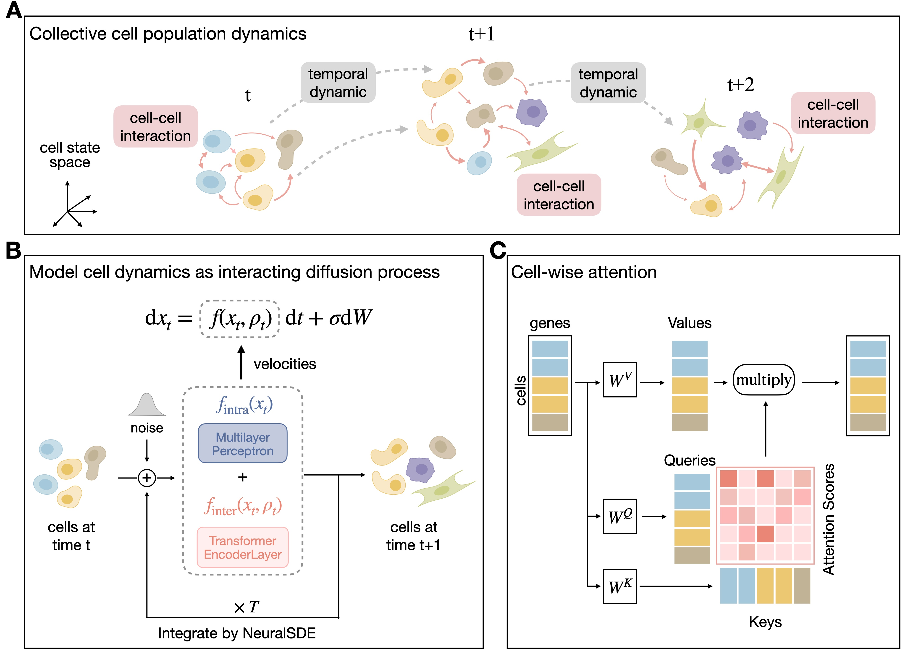

# Learning collective multi-cellular dynamics from temporal scRNA-seq via a transformer-enhanced Neural SDE

**Authour**: Qi Jiang, Lei Zhang, Longquan Li and Lin Wan


Time-series single-cell RNA-sequencing (scRNA-seq) datasets offer unprecedented insights into the dynamics and heterogeneity of cellular systems. These systems exhibit multiscale collective behaviors driven by intricate intracellular gene regulatory networks and intercellular interactions of molecules. However, inferring interacting cell population dynamics from time-series scRNA-seq data remains a significant challenge, as cells are isolated and destroyed during sequencing. To address this, we introduce scIMF, a single-cell deep generative Interacting Mean Field model, designed to learn collective multi-cellular dynamics. Our approach leverages a transformer-enhanced stochastic differential equation network to simultaneously capture cell-intrinsic dynamics and intercellular interactions. Through extensive benchmarking on multiple scRNA-seq datasets, scIMF outperforms existing methods in reconstructing gene expression at held-out time points, demonstrating that modeling cell-cell communication enhances the accuracy of multicellular dynamics characterization. Additionally, our model provides biologically interpretable insights into cell-cell interactions during dynamic processes, offering a powerful tool for understanding complex cellular systems.


# Datasets
We benchmark the performance of scIMF on three time-series scRNA-seq datasets: 
(1) zebrafish embryogenesis ([Farrell et al., 2018](https://www.science.org/doi/10.1126/science.aar3131)), 
(2) reprogramming of mouse embryonic fibroblasts to induced pluripotent stem cells ([Schiebinger et al., 2019](https://www.cell.com/cell/fulltext/S0092-8674(19)30039-X)), 
(3) pancreatic β-cell differentiation24 ([Veres et al., 2019](https://www.nature.com/articles/s41586-019-1168-5)).
For the dataset of zebrafish embryogenesis (ZB data), we downloaded the data from [https://singlecell.broadinstitute.org/single_cell/study/SCP162](https://singlecell.broadinstitute.org/single_cell/study/SCP162). 
For the dataset of reprogramming of mouse embryonic fibroblasts to induced pluripotent stem cells (MEF data), we downloaded the data from [https://broadinstitute.github.io/wot/tutorial/](https://broadinstitute.github.io/wot/tutorial/).
For the dataset of pancreatic β-cell differentiation (Panc data), we downloaded the data in the NCBI under accession number [GSE114412](https://www.ncbi.nlm.nih.gov/geo/query/acc.cgi?acc=GSE114412).

Detailed pre-processing steps for these datasets can be found in the catalogues ./data/ZB, ./data/MEF and ./data/Panc

You can download the preprocessed data [here](https://drive.google.com/drive/folders/1WdB9G0c_b0R6Whk_U4iJVTq2KejfYQJS?usp=share_link)

# Getting Started
PI-SDE takes the input of time-series scRNA-seq data and outputs:
- predicted gene expressions at unseen time points,
- the reconstructed potential energy landscape that resembles the original Waddington landscape,
- inferred cellular velocity.

## Requirements and Setup

```bash
conda create -n pi-sde python=3.7.16
conda activate pi-sde 
pip install -r requirements.txt
```


## Fate task on Veres data (train on all time points)

```bash
python run_fate.py
```

## Held-out task on Veres data

```bash
python run_leaveout.py
```
